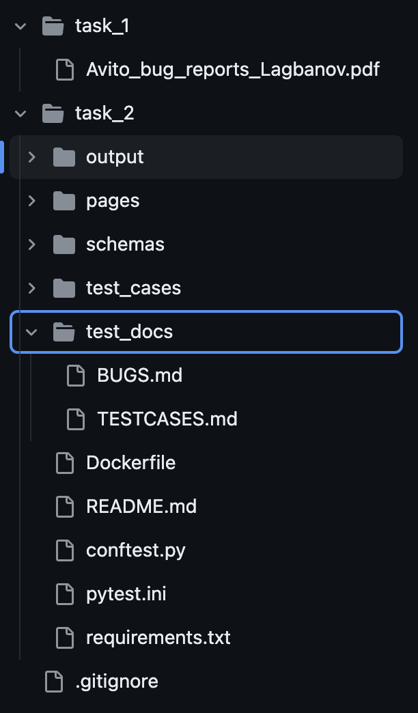
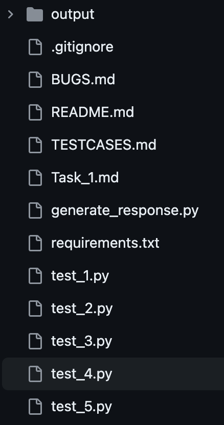
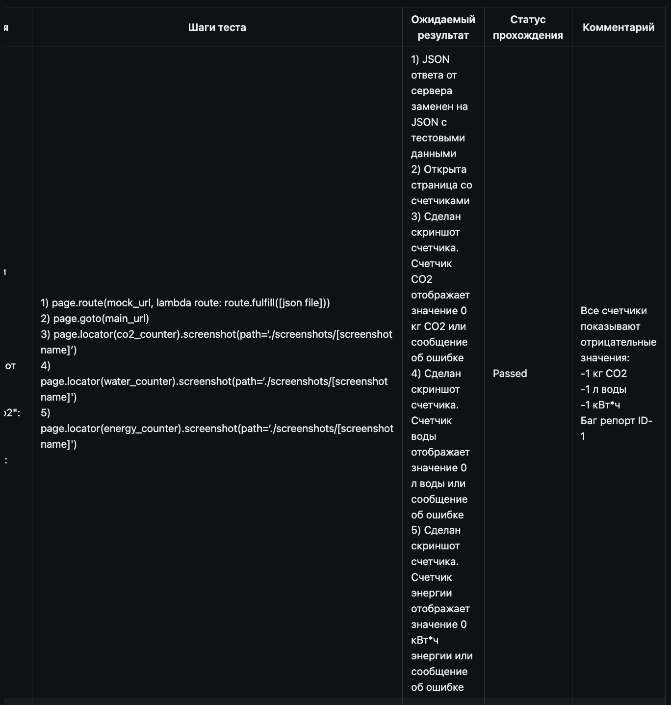
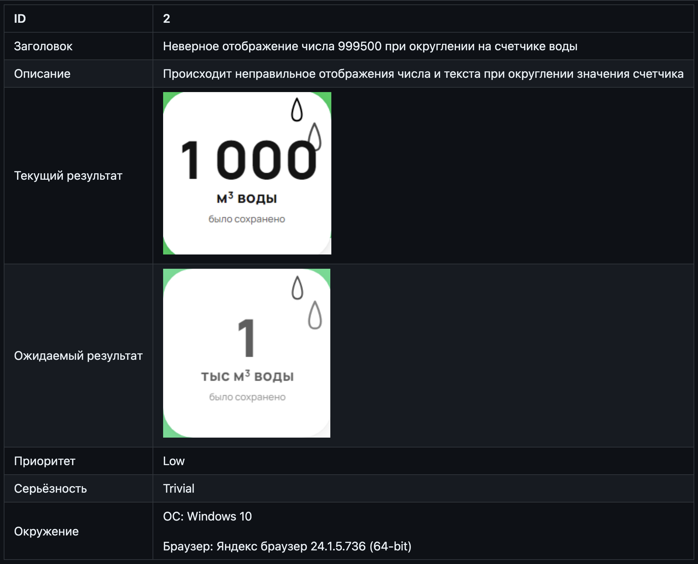
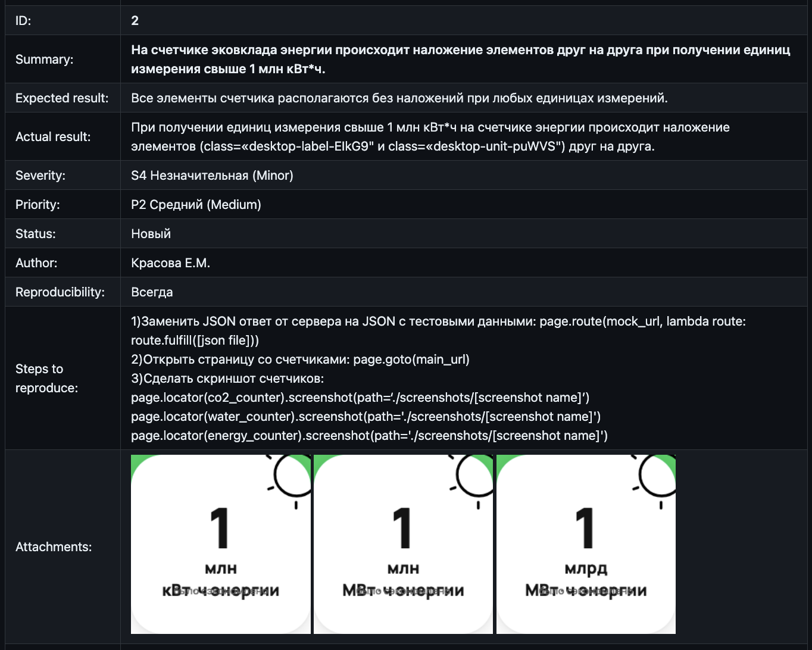

# Обзор вариантов выполнения задания на написание автотеста
В этом году при составлении тестового задания мне хотелось выйти из коробочки blackbox UI e2e тестирования и дать стажёрам пощупать что-то настоящее, чтобы они исследовали и увидели немного изнанки современных подходов к построению сервисов. 
На одной странице несколько микрофронтов. Фронтенд — это только отображение данных с бекенда. Знает ли бекенд, что может, а что не может отобразить фронт? Готов ли фронтенд отобразить всё, что пришлёт ему бекенд?

Что такое хороший автотест? Этот вопрос часто встречается на собеседованиях, и на него можно ответить с разной степенью подробности.
Атомарный, читаемый, стабильный... — список характеристик можно продолжать, я встречал списки, в которых было и 25 пунктов в том же духе.
Но кончается ли дело автотестом? Для чего он вообще написан?

Все представленные варианты выполнения задания прошли отбор.

### Структура проекта
#### Иерархичная стурктура, понятные названия:


#### Плоская структура с безликими именами:

### Инструкция 
Инструкция: чем проще, тем лучше: склонировать, установить зависимости, запустить.

### Инструкция по запуску тестов

#### В меру подробная инструкция
1. Склонируйте к себе репозиторий, в котором хранится проект тестового задания, через выполнение команды в терминале
    ```
    git clone https://github.com/Herzenswearme/AvitoTech_QA-trainee.git
    ```
    Или скачайте zip архив по [ссылке](https://github.com/Herzenswearme/AvitoTech_QA-trainee/archive/refs/heads/main.zip) и распакуйте его


2. Убедитесь, что на Вашем компьютере установлен Python. В командной строке/терминале выполните команду
    ```
    python -v
    ```  

    Если он не установлен, то установите с официального [сайта Python](https://www.python.org/downloads/), выбрав подходящую версию для Вашей операционной системы, и пройдите шаг сначала.  
    >В процессе установки обязательно поставьте галочку в чекбоксе "Add python.exe to PATH". Иначе, у Вас не будет корректно отображаться версия Python


3. Через командную строку/терминал перейдите в корневую директорию проекта, выполнив команду
   ```
   cd /здесь укажите путь до директории с проектом
   ```


4. Установите необходимые зависимости из файла `requirements.txt`, выполнив команду  
   ```
   pip install -r requirements.txt
   ```
   если она не выполняется, то попробуйте
   ```
   pip3 install -r requirements.txt
   ```


5. После успешной установки зависимостей, установите необходимые бинарные файлы браузеров, выполнив команду
   ```
   playwright install
   ```
   

6. Наконец, запустите тесты, выполнив команду  
   ```
   pytest -v
   ```

### Параметризация
Однобуквенная переменная, хранящая все кейсы в одном списке — трудная для восприятия структура.
```python
    a = [1, 999, 1000, 1001, 9954, 9955, 10000, 10001, 10049, 10050, 99950, 100000, 100499, 100500, 999449, 999500,
          1000000, 1044000, 1045000, 999449000, 999500000, 1000000000]
    for i, elem in enumerate(a):
        page.goto("https://www.avito.ru/avito-care/eco-impact", wait_until="domcontentloaded")

```

Использована параметризация, кейсы объединены в классы эквивалентности, у кейсов есть имя.
Что можно улучшить: здесь очевидно можно избавиться от дублирования чисел. 
```python
@pytest.mark.parametrize('co2, energy, materials, pine_years, water, test_case', (
        (0, 0, 0, 0, 0, 'TK-1'),
        (999, 999, 999, 999, 999, 'TK-2'),
        (1000, 1000, 1000, 1000, 1000, 'TK-3'),
        (1500, 1500, 1500, 1500, 1500, 'TK-4'),
        (1000000, 1000000, 1000000, 1000000, 1000000, 'TK-5'),
        (1000000000000, 1000000000000, 1000000000000, 1000000000000, 1000000000000, 'TK-6'),
        (1000000000000000, 1000000000000000, 1000000000000000, 1000000000000000, 1000000000000000, 'TK-7'),
        (-1, -1, -1, -1, -1, 'TK-8'),
))
```

Тут есть ссылка
```python
        replaceable_responses = [
            generate_response(co2=1, energy=50, water=999),  # ОР: co2 = 1 кг, energy = 50 кВт/ч, water = 999 л
            generate_response(co2=1000, energy=1000, water=1000),  # ОР: co2 = 1 т, energy = 1 МВт/ч, water = 1 м3
            generate_response(co2=1000000, energy=1000000, water=1000000),  # ОР: co2 = 1 тыс. т, energy = 1 тыс. МВт/ч, water = 1 тыс. м3
            generate_response(co2=1000000000, energy=1000000000, water=1000000000),  # ОР: co2 = 1 млн. т, energy = 1 млн. МВт/ч, water = 1 млн. м3
            generate_response(co2=1000000000000, energy=1000000000000, water=1000000000000),  # ОР: co2 = 1 млрд. т, energy = 1 млрд. МВт/ч, water = 1 млрд. м3
            generate_response(co2=1000000000000000, energy=1000000000000000, water=1000000000000000)  # ОР: co2 = 1 квдрлн. т, energy = 1 квдрлн. МВт/ч, water = 1 квдрлн. м3
        ]
```

### Тесткейсы
Таблица с узкими колонками и горизонтальным скролом — проявление неуважения к читающему.


### Багрепорт
Чёткая структура, багрепорт — как карточка, которая помещается на один экран. 




